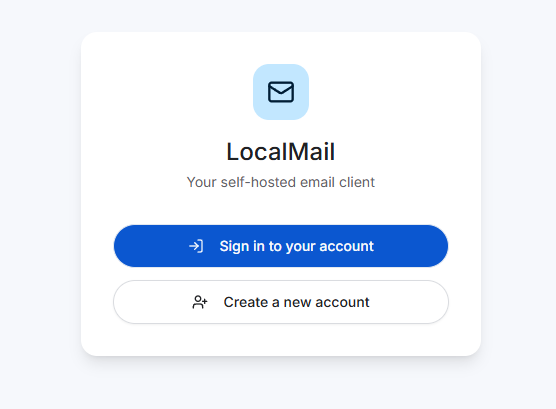
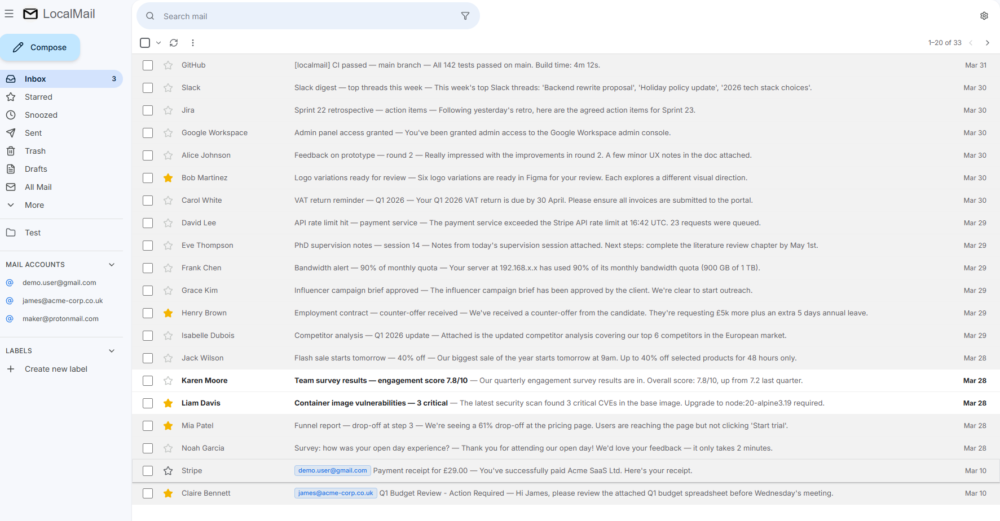
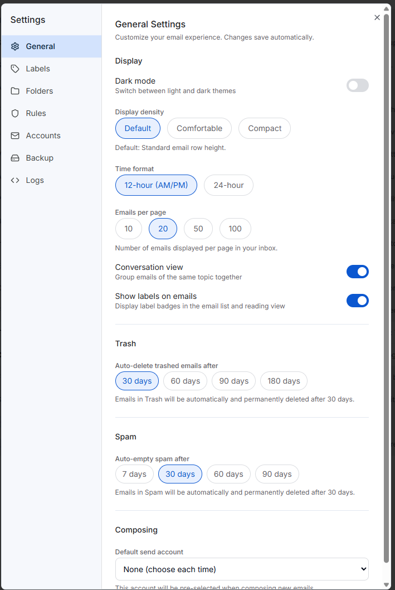
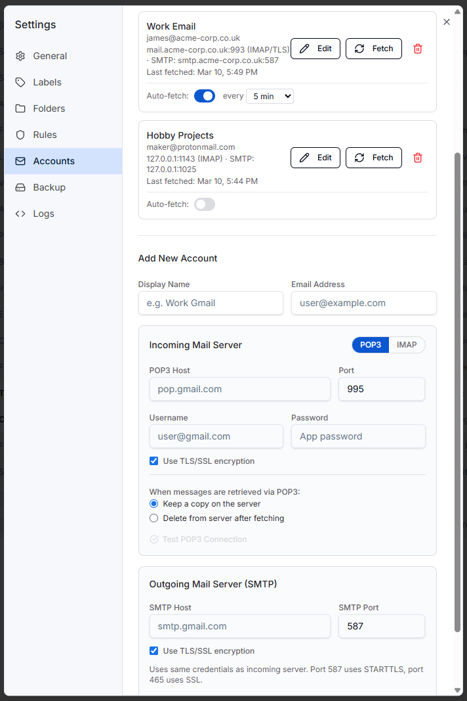

# LocalMail

[](https://hub.docker.com/r/jahuuk/localmail-app)

A self-hosted, Gmail-inspired email client. Connect your existing email accounts via POP3, IMAP, and SMTP — read, send, and organise your mail through a familiar web interface, without relying on any third-party cloud service. Your data never leaves your machine.



---

## Features

A robust list of features have been implemented into the image, the main call outs are below:

- **Multi-account** — Connect unlimited POP3/IMAP/SMTP accounts (Gmail, Outlook, ProtonMail Bridge, self-hosted, etc.)
- **Gmail-style UI** — Folders, labels, starring, multi-select, bulk actions, drag-and-drop, dark mode
- **Rich HTML emails** — Safely rendered HTML with inline images, plus plain text toggle
- **Compose** — Rich text editor with CC/BCC, attachments, image paste, contact autocomplete, and auto-save drafts
- **Multi-user** — Each user gets their own isolated mailbox, accounts, labels, and settings
- **Admin panel** — Manage users, reset passwords, oversee the instance
- **Email rules** — Automatically move, label, star, or mark emails on arrival
- **Custom folders** — Create folders with colour coding alongside the standard set
- **Auto-fetch** — Scheduled polling per account (5–60 min intervals)
- **Backup** — Local file download/restore and scheduled cloud backup (Amazon S3, Azure Blob, Google Cloud Storage)
- **Activity logs** — Built-in log viewer for fetch, send, backup, and error events
- **Attachment previews** — Images with lightbox, inline PDF viewer, standard download for other types







### Security

- User passwords hashed with **bcrypt**
- All emails **encrypted at rest** with AES-256-CBC
- Mail account credentials (POP3/IMAP/SMTP passwords) **encrypted at rest**
- Cloud backup credentials **encrypted at rest**
- Session-based authentication; sessions invalidated on logout

---

## Quick Start

### Docker (Recommended)

The easiest way to get started — no build step required. The image is published on Docker Hub at [`jahuuk/localmail-app`](https://hub.docker.com/r/jahuuk/localmail-app).

**1. Create a `docker-compose.yml`**

```yaml
services:
  localmail:
    image: jahuuk/localmail-app:latest
    container_name: localmail
    ports:
      - "5000:5000"
    volumes:
      - localmail_data:/app/data
    environment:
      - ENCRYPTION_KEY=REPLACE_WITH_OUTPUT_OF__openssl_rand_-hex_32
      - ADMIN_USERNAME=admin
      - ADMIN_PASSWORD=REPLACE_WITH_A_STRONG_PASSWORD
    restart: unless-stopped

volumes:
  localmail_data:
```

Replace the `ENCRYPTION_KEY` and `ADMIN_PASSWORD` values before starting. Generate a key with:

```bash
openssl rand -hex 32
```

**2. Start**

```bash
docker compose up -d
```

Open `http://localhost:5000`. Log in with the admin credentials you set above.

**3. Update to a new version**

```bash
docker compose pull
docker compose up -d
```

Data is stored in a Docker named volume (`localmail_data`) — fully self-contained inside Docker. All emails, settings, and account passwords survive updates and container restarts automatically.

---

### Docker (Build from Source)

If you want to build the image yourself from this repository:

```bash
git clone <your-repo-url> localmail
cd localmail
docker compose up -d --build
```

Open `docker-compose.yml` and replace the `ENCRYPTION_KEY` and `ADMIN_PASSWORD` placeholders before starting.

---

### Windows Service

Requires Node.js 20+. Run PowerShell **as Administrator**:

```powershell
.\install-windows.ps1
```

The installer will:
- Prompt for an admin username and password
- Generate a unique encryption key automatically and save it to `data\.localmail-config`
- Register LocalMail as a Windows service that starts automatically on boot

Open `http://localhost:5000` after installation.

**Uninstall:**

```powershell
.\install-windows.ps1 -Uninstall
```

App data in the install directory is not removed — delete it manually if needed.

---

### Linux (systemd)

For bare-metal or VM installs on Linux without Docker.

**1. Install Node.js 20+**

```bash
curl -fsSL https://deb.nodesource.com/setup_20.x | sudo -E bash -
sudo apt install -y nodejs
```

**2. Build the app**

```bash
git clone <your-repo-url> /opt/localmail
cd /opt/localmail
npm ci
npm run build
```

**3. Create a dedicated user**

```bash
sudo useradd -r -s /bin/false localmail
sudo chown -R localmail:localmail /opt/localmail
```

**4. Create the systemd service**

Create `/etc/systemd/system/localmail.service`:

```ini
[Unit]
Description=LocalMail Email Client
After=network.target

[Service]
Type=simple
User=localmail
WorkingDirectory=/opt/localmail
ExecStart=/usr/bin/node dist/index.cjs
Restart=on-failure
RestartSec=5

Environment=NODE_ENV=production
Environment=PORT=5000
Environment=ENCRYPTION_KEY=<output of: openssl rand -hex 32>
Environment=ADMIN_USERNAME=admin
Environment=ADMIN_PASSWORD=<your-strong-password>

[Install]
WantedBy=multi-user.target
```

**5. Start and enable**

```bash
sudo systemctl daemon-reload
sudo systemctl enable --now localmail
sudo systemctl status localmail
```

**Updating:**

```bash
cd /opt/localmail
git pull
npm ci
npm run build
sudo systemctl restart localmail
```

---

## HTTPS & Reverse Proxy

LocalMail runs on plain HTTP. For secure access put it behind a reverse proxy - and do not make this a public facing app as the admin portal is now fantastically mature as of yet. This is meant for personal/homelab use. I would recommend Caddy for ease of use.

---

## Data Storage

Everything lives in the `data/` directory — no external database required:

```
data/
  users.json                       # User accounts (bcrypt-hashed passwords)
  .encryption-key                  # Auto-generated key (if ENCRYPTION_KEY env not set)
  users/<user-id>/
    storage.json                   # Accounts, labels, settings, email rules, backup config
    emails/<email-id>.json         # Encrypted email files (AES-256-CBC)
    attachments/<email-id>/        # Attachment files per email
```

---

## Backup & Recovery

### Local backup (built-in)

Settings → Backup → **Download Backup** produces a `.zip` of your entire `data/` directory for your user. Restore by uploading that same file from the same panel.

### Cloud backup (built-in)

Settings → Backup → Cloud Backup supports Amazon S3, Azure Blob Storage, and Google Cloud Storage. Set a schedule (daily/weekly/monthly) or trigger manually. Backup history and one-click restore are available from the same panel. All cloud credentials are encrypted at rest.

### Manual backup

For a full-instance backup (all users):

```bash
# Docker — export the named volume while running
docker run --rm \
  -v localmail_data:/data \
  -v $(pwd):/backup \
  alpine tar czf /backup/localmail-backup-$(date +%F).tar.gz -C /data .

# Restore from that archive
docker run --rm \
  -v localmail_data:/data \
  -v $(pwd):/backup \
  alpine sh -c "cd /data && tar xzf /backup/localmail-backup-<date>.tar.gz"

# Linux bare-metal — while stopped (safest)
cp -r /opt/localmail/data /backup/localmail-$(date +%F)
```

**Critical:** Always back up your `ENCRYPTION_KEY` (or `data/.encryption-key`) separately from your data. Without it, encrypted emails and account passwords cannot be decrypted.

---

## Best Practices

### All platforms

- **Change the default credentials** before first boot. `ADMIN_PASSWORD=changeme` is a placeholder.
- **Generate a unique `ENCRYPTION_KEY`** with `openssl rand -hex 32`. Never share it or commit it to version control.
- **Back up the encryption key separately** from your data. Store it in a password manager or secrets vault.
- **Use HTTPS** for any access beyond localhost. Plain HTTP exposes session cookies and email content.
- **Keep the app updated** — pull and rebuild regularly to get security and bug fixes.
- **Restrict access by IP** at the firewall/proxy level if the instance is not intended to be public.

---

## Docker Hub

The official image is published at [`jahuuk/localmail-app`](https://hub.docker.com/r/jahuuk/localmail-app).

```bash
docker pull jahuuk/localmail-app:latest
```

---

## License

MIT
